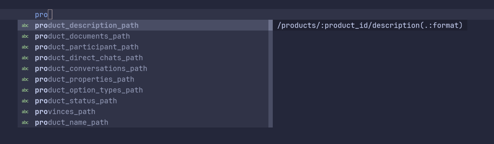

# blink-cmp-rails-routes



Adds Ruby on Rails route suggestions as a source for [Saghen/blink.cmp](https://github.com/Saghen/blink.cmp)

## Installation & Usage

### lazy.nvim

```lua
return {
  {
    "saghen/blink.cmp",
    dependencies = { "hoangnghiem/blink-cmp-rails-routes" },
    opts = {
      sources = {
        providers = {
          rails_routes = {
            module = "blink-cmp-rails-routes",
            name = "Rails routes",
          },
        },
      },
      -- optional: trigger only on C-w
      keymap = {
        ["<C-w>"] = {
          function(cmp)
            cmp.show({ providers = { "rails_routes" } })
          end,
        },
      },
    },
  },
}
```
Command:
```vim
" Run this command on first installation or any changes in your routes
:RailsRoutesSync
```
## License
See [License](./LICENSE).
